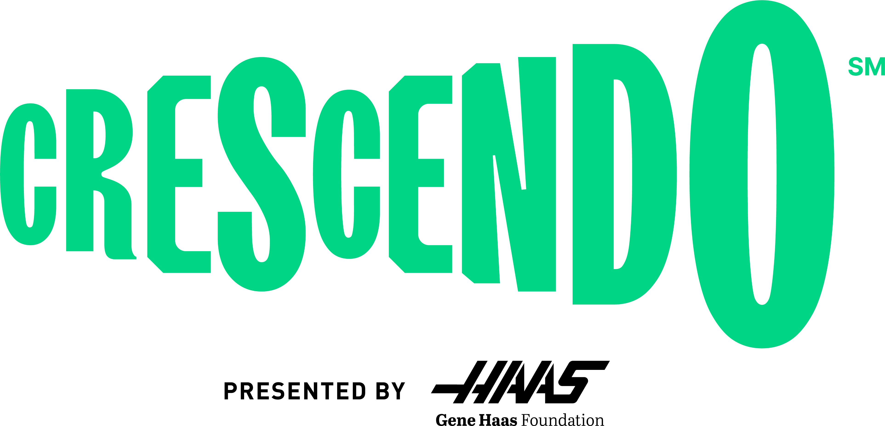

# FRC 2024

This is FRC 5160's robot code for the 2024 season.

Some features of our codebase include:

1. Custom units library with minimal runtime overhead([Kmeasure](https://github.com/battery-staple/KMeasure)).
2. Vendor hardware wrappers for easy swapping of different hardware components and simulation support
3. Lightweight logging framework which logs to datalog + networktables, and tuning framework which interfaces with SmartDashboard
4. Swerve with pathplanner support, motion profiling and more
5. A custom command DSL which combines the best parts of subclassed and inline commands.
